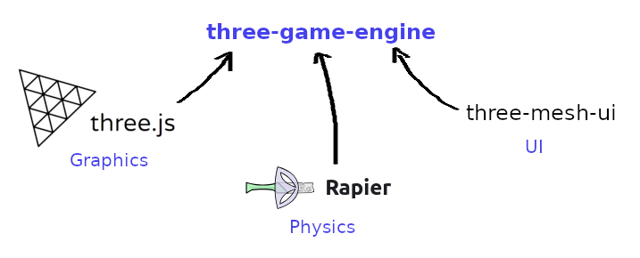

# three-game-engine
Simple, lightweight game engine using:
 - Three.js - a 3D WebGL-based Graphics Engine (https://github.com/mrdoob/three
 - Rapier - a 3D Physics Engine (https://github.com/dimforge/rapier.js)
 - three-mesh-ui - Toolkit for building 3D user interfaces in Three.js

This library simply ties together several well known, capable javascript libraries resulting in a powerful yet simple game engine.

## The vision
 - to create an easy-to-use, easy-to-setup versatile 3D game engine for developers that love and respect javascript
 - to allow for full use of the underlying libraries
 - maintain source code that is highly readable, and extendable
 - to offer VR support

MUCH TO COME VERY SOON - THIS LIBRARY HAS JUST RECENTLY BEEN STARTED

# Library API

## Game API (import Game from 'three-game-engine')
This is the top-level object that you typically create and configure just once.

| Function                                     | Description                                                                      |
| -------------------------------------------- | -------------------------------------------------------------------------------- |
| constructor(options)                         | Creates a new game, with a WebGL1 renderer setup with the specified options      |
|                                              |                                                                                  |
| async loadScene(scene)                       | Async function that loads and switches to rendering a Scene (see Scene API)      |

## game.renderer
A game object internally manages a Renderer object (accessed by game.renderer).
This contains all the functionality that manages and implements a renderer loop using a Three.js WebGL1 Renderer object internally.

## Scene API  (import Scene from 'three-game-engine')
A game is developed as set of Scenes. The game at any given time is always actively displaying a single scene.
Scenes can represent different levels, areas, menus, hubworlds, or even loading screens in a game.
A scene internally manages a Three.js Scene object.

| Function                                     | Description                                                                      |
| -------------------------------------------- | -------------------------------------------------------------------------------- |
| constructor(sceneData)                       | Creates a 3D scene from the given data                                           |

## GameObject API  (import GameObject from 'three-game-engine')
A scene contains a hieriarchy of GameObjects.
Each GameObject corresponds to an Object3D (and its children) within the underlying three.js scene.

| Function                                     | Description                                                                      |
| -------------------------------------------- | -------------------------------------------------------------------------------- |
| constructor(parent, options)                 | Creates a GameObject as a child of either a scene or another GameObject.         |
