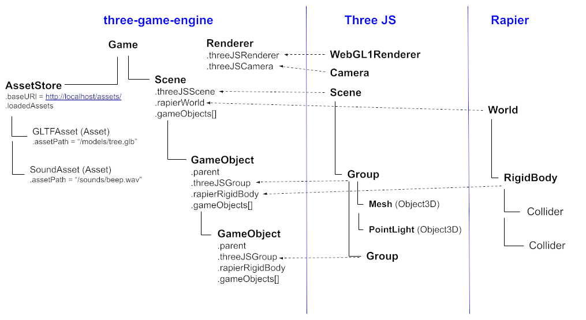

[](https://badge.fury.io/js/three-game-engine)

# UNDER CONSTRUCTION
This library has just recently been started, but aims to provide a fully usable 1.0.0 release by sometime in January or February 2024.

# three-game-engine
Simple, lightweight game engine using:
 - Three.js - a 3D WebGL-based Graphics Engine (https://github.com/mrdoob/three
 - Rapier - a 3D Physics Engine (https://github.com/dimforge/rapier.js)
 - three-mesh-ui - Lets you build 3D user interfaces in Three.js (https://github.com/felixmariotto/three-mesh-ui)

This library simply ties together several well known, capable javascript libraries resulting in a powerful yet simple game engine.


## The Vision
 - to make it easy to tie together 3 great javascript libraries: ThreeJS, Rapier3D, and three-mesh-ui to create a versatile, easy to use 3D game engine.
 - to allow javascript lovers to easily jump into game development, using tools and libraries familiar to them.
 - to offer a 100% free engine that can be used by anyone to build personal or comercial apps/games.
 - maintain source code that is highly readable, and extendable
 - to offer VR support


# Architecture
This game engine allows you to manage a Scene of GameObjects.
Each GameObject controls a Group in the ThreeJS scene graph, and can optionally be associated with a Rapier RigidBody with colliders.




# Project files
A game consists of a folder, pointed to by a base URL (the first argument to the Game object contructor).
All other URLs to various json files and other assets are assumed to be relative to the base URL.
The base URL might be an HTTP, HTTPS or even a file:// URL (useful for building cordova and/or 
electron apps which refer to application files storred locally).

```
  const game = new Game('http://localhost:8000/myprojectfolder');
```

- Based on the above base URL your game.json would be fetched from http://localhost:8000/myprojectfolder/game.json

## game.json
This file controls game-level settings, and points to a series of scenes each described by a separate JSON file.

```
{
  "rendererOptions": { ... }, // optional, see RendererOptions
  "assetOptions": { ... }, // optional, see AssetOptions

  "initialScene": "mainMenu",

  // A game contains a series of scenes that you can switch between (See Scene JSON files)
  "scenes": {
    "mainMenu": "scenes/main_menu.json",
    "loadingScene": "scenes/loading.json",
    "scene1": "scenes/scene1.json"
  },

  // Scene JSON files can create game objects of several predefined "types"
  "gameObjectTypes": {
    "player": "game_objects/player.json"
  },
}
```

### RendererOptions

| Property                     | Description                                                                                       |
| -----------------------------| ------------------------------------------------------------------------------------------------- |
| .width                       | The width in pixels to be applied to the ThreeJS WebGL renderer.                                  |
| .height                      | The height in pixels to be applied to the ThreeJS WebGL renderer.                                 |
| .pixelRatio                  | The pixelRatio in pixels to be applied to the ThreeJS WebGL renderer, most apps pass in window.devicePixelRatio  |
| .cameraOptions               | See CameraOptions below                                                                           |
| .setupFullScreenCanvas       | If true, a canvas HTML element will automatically be created and added to the DOM, stretched to fill the window, and be used by ThreeJS to render onto.  |

### AssetOptions

| Property                  | Description                                                                      |
| ------------------------- | -------------------------------------------------------------------------------- |
| .retainAssetsBetweenScene | (default: false) if true the game's assetstore will not clear assets when loading a scene, which can make switching back to scenes already loaded quicker, and loading scenes with assets used in previously loaded scenes quicker. |

#### CameraOptions
These values will be passed onto the ThreeJS PerspectiveCamera created automatically by game.renderer.

| Property                 | Description                                                                      |
| -------------------------| -------------------------------------------------------------------------------- |
| .fov                     | Field of view.                                                                   |
| .aspect                  | Aspect ratio                                                                     |
| .near                    | Near value                                                                       |
| .far                     | Far value                                                                        |


# Scene JSON files
Scenes are defined by a JSON file, that controls the layout of a hierarchy of game objects.

```
{
  "gameObjects": [
    // You can define individual, unique GameObjects like this:
    { 
      "name": "ground",
      "models": [
        { "assetPath": "models/ground.glb" }
      ],
      "lights": [
        { "type": "AmbientLight", "intensity": 0.5 }
      ],
      "position": { "x": 5, "y": 0, "z": 0 }
    },

    // OR you can create a game object of a given "type",
    // which will inherit all the properties of the game object type's .json file
    // declared for this type in your game.json file.
    { 
      "type": "player",
      "position": { "x": 5, "y": 0, "z": 0 }
    }
  ]
}
```

# GameObject Type JSON
You can define a "type" of GameObject by a .json file, to create re-usable, generalized GameObjects that all
are based off a common set of properties (eg. all share the same models/physics properties etc.)

This is similar to creating a pre-fab in engine's like Unity.

```
{
  // A GameObject can clone all the mesh data from a given .gltf or .glb file.
  // These will be addded as children of the GameObjects .threeJSGroup.
  "models": [
    { "assetPath": "models/player.glb" }
  ],

  // Similarly, game objects can parent ThreeJS lights of any type:
  "lights": [
    { "type": "PointLight", "position": { "x": 0, "y": 5, "z": 0 } }
  ],

  // A gameobject can optionally have a Rapier RigidBody, and colliders attached to it.
  "rigidBody": {
      "type": "kinematicPositionBased",
      "colliders": [
          { "type": "capsule", "halfHeight": 0.5, "radius", 0.5 }
      ],
      "enabledRotations": { "x": false, "y": true, "z": false }
  },

  // GameObjects can also contain MeshUIComponents
  // (created via three-mesh-ui) which will added to the GameObject's threeJSGroup
  "userInterfaces": [
    {
      "type": "Block",
      "children": [
        {
          "type": "Text",
          "content": "Hello world!"
        }
      ]
    }
  ]
}
```

# Asset Files
Game objects can reference various types of asset files such as 
gltfs, sounds, images, scene JSON files, game object type JSON files, etc.
These files are loaded and cached when the first game object using them is loaded into a scene.


# GameObject Classes
A GameObject type can also be (optionally) associated with a GameObject sub-class.

Use game.registerGameObjectClasses() to link your javascript GameObject class to a type of
GameObject:

```
  game.registerGameObjectClasses({
    player: PlayerGameObject, 
    type2: Class2,
    ...
  })

  // Explanation: game objects of type "player" will be instantiated 
  // using your PlayerGameObject class, game objects of type "type2"
  // will use Class2, etc.
```

This allows you to add scripting / behavior to your game objects:

```
  class PlayerGameObject extends GameObject {
      afterLoaded() {
        // called once when this GameObject and its scene gets loaded
        this.y = 0;
      }

      beforeRender({ deltaTimeInSec }) {
        // Called once per frame
        this.setRotation(0, this.y, 0);
        this.y += 1 * deltaTimeInSec;
      }
  }
```

# Examples
The examples/ folder In this repo contains several simple example apps that that demonstrate features of the engine.
To run the examples in your browser, clone this repo then run:

```
  npm install
  npm run examples
```

# Desktop and Mobile Apps
In addition to using this library to build web apps that run in your browser, 
with third party tools like electron, cordova, etc. you can easily package and 
distribute your game as a desktop app or mobile app.

This repo contains complete working examples of:
- How to use electron & electron-forge to package your game as a desktop app,
  see [examples/electron](https://github.com/WesUnwin/three-game-engine/tree/main/examples/electron)
- How to package your app as an android or iOS app using Apache Cordova,
  see [examples/cordova](https://github.com/WesUnwin/three-game-engine/tree/main/examples/cordova)


# API Reference
Top level objects:

```
  import { Game, Scene, GameObject } from 'three-game-engine';

  // See descriptions below of each of these top level objects
```

## Game API
This is the top-level object that you typically create and configure just once.

| Function                                     | Description                                                                      |
| -------------------------------------------- | -------------------------------------------------------------------------------- |
| new Game(baseURL)                            | Creates a new game, reading the options specified in the game.json file found at the given base URL. |
| async loadScene(sceneName)                    | Async function that loads and switches to rendering the scene with the given name. |
| play()                                       | Starts (or resumes) rendering of the game, rendering the currently loaded scene. |
| pause()                                      | Pauses rendering of the game till play() is called again.                        |
| async loadAsset(assetPath)                   | Tells game.assetStore to fetch a given asset (such a .gltf/glb file) and store it for future use. Assets needed by GameObjects are automatically, loaded when the GameObject is loaded into a scene, but this can be used to make assets ready in advance. |
| getAssetStore()                              | Returns the asset store instance game.assetStore used by this game object.       |

## Scene API
A game is developed as set of Scenes. The game can actively render just one scene (or none) at a given time.
Scenes can represent different levels, areas, menus, hubworlds, or even loading screens in a game.
A Scene internally manages a Three.js Scene object.

| Function                                     | Description                                                                      |
| -------------------------------------------- | -------------------------------------------------------------------------------- |
| addGameObject(gameObject)                    | Adds the given GameObject to the scene.                                         |
| removeGameObject(gameObject)                 | Removes the given GameObject from the scene.                                     |
| getRootGameObjects()                         | Returns all top level game objects in the scene.                                 |
| getGameObject(fn)                                     | Returns the first game object where the function fn(gameObject) returns true.     |
| getGameObjects(fn)                                  | Returns an array of game objects where the given function fn(gameObject) returns true. |
| getGameObjectWithName(name)                             | Returns the first game object in the scene with the given name.                   |
| getGameObjectsWithTag(tag)                            | Returns all game objects in the scene that have the given.                        |

## GameObject API
A scene contains a hieriarchy of GameObjects.

All game objects are an instance of GameObject, or a sub-class of GameObject that your application may define.
Creating a GameObject sub-class is a great way of generalizing the behavior of a given set of game objects. 

Each GameObject internally manages a ThreeJS Group (gameObject.threeJSGroup).
The group object can contain various graphical 3D models, lights and other ThreeJS Object3Ds within it.

A GameObject can also optionally have a RapierJS RigidBody (gameObject.rapierRigidBody).
The RigidBody can be used to control the physics and collision detection aspects of the GameObject.

| Function                                     | Description                                                                      |
| -------------------------------------------- | -------------------------------------------------------------------------------- |
| new GameObject(parent, options)              | Creates a GameObject as a child of either a scene or another GameObject.         |
| addGameObject(gameObject)                    | Adds the given GameObject as a child of this GameObject.                          |
| removeGameObject(gameObject)                 | Removes the given GameObject if it is an immediate child of this GameObject.      |
| getRootGameObjects()                         | Returns all immediate child GameObjects of this GameObject.                      |
| getGameObject(fn)                                     | Returns the first game object where the function fn(gameObject) returns true. |
| getGameObjects(fn)                                  | Returns an array of game objects where the given function fn(gameObject) returns true. |
| getGameObjectWithName(name)                             | Returns the first descendent game object with the given name.                    |
| getGameObjectsWithTag(tag)                            | Returns an array of all descendent game objects that have the given tag.        |